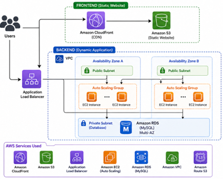

Cloud Application Infrastructure (AWS + Terraform)

Overview

This project demonstrates a production-grade cloud architecture deployed on AWS using Terraform.

It includes a scalable frontend, highly available backend, and managed database, all built using Infrastructure as Code (IaC).

##  Architecture Diagram

 Technologies Used:

* Terraform (Infrastructure as Code)
* AWS S3 (Static Hosting)
* AWS CloudFront (CDN)
* AWS EC2 (Compute)
* AWS Auto Scaling
* AWS Application Load Balancer
* AWS RDS (MySQL)
* AWS VPC (Networking)

Features

*  Scalable backend with Auto Scaling
*  High availability with multi-AZ setup
*  Secure frontend using private S3 + CloudFront
*  Load-balanced traffic handling
*  Managed database (RDS)
*  Fully automated infrastructure with Terraform

 Live Demo

Frontend (CloudFront):
d196mniqhvwk1y.cloudfront.net

Backend (Load Balancer):
cloudapp-dev-alb-1606593752.eu-west-1.elb.amazonaws.com

How to Run

bash:
git clone https://github.com/sakshipanchalegit/cloudapp-terraform-aws.git
cd cloudapp-terraform-aws

aws configure
terraform init
terraform apply

 Security Notes

* Sensitive files are excluded using `.gitignore`
* IAM best practices recommended for production
* Database credentials should be stored securely (Secrets Manager)

Future Improvements

* Add custom domain (Route53)
* Enable HTTPS (ACM SSL certificate)
* Add CI/CD pipeline (GitHub Actions)
* Build backend API (Node.js / Python)

Author

Sakshi Panchale
Cloud Engineering Project using AWS & Terraform
